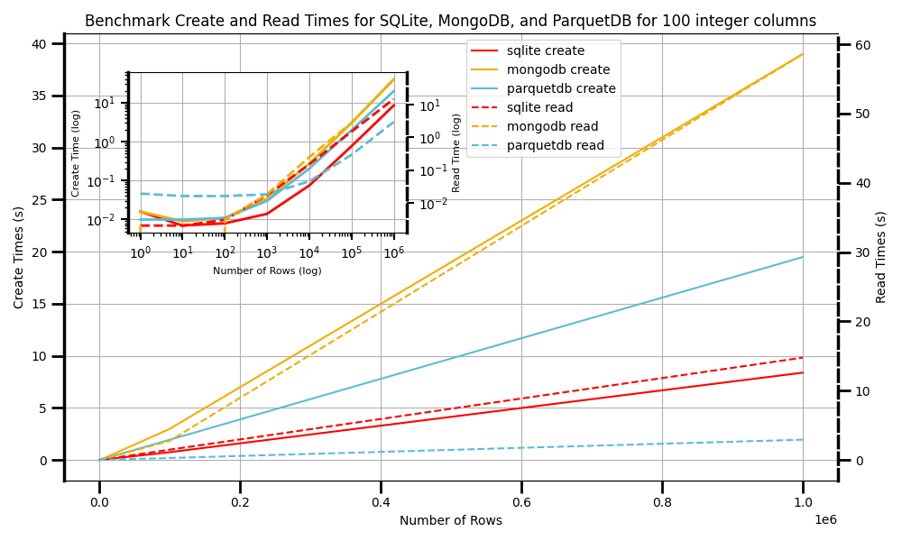

# ParquetDB

ParquetDB is a lightweight database-like system built on top of Apache Parquet files using PyArrow. It offers a simple and efficient way to store, manage, and retrieve complex data types without the overhead of serialization, which is often a bottleneck in machine learning pipelines. By leveraging Parquet's columnar storage format and PyArrow's computational capabilities, ParquetDB provides high performance for data-intensive applications. 




## Table of Contents

- [Features](#features)
- [Why ParquetDB?](#why-parquetdb)
- [Installation](#installation)
- [Quick Start](#quick-start)
- [Usage](#usage)
  - [Creating a Database](#creating-a-database)
  - [Adding Data](#adding-data)
  - [Reading Data](#reading-data)
  - [Updating Data](#updating-data)
  - [Deleting Data](#deleting-data)
- [Benchmark Overview](#benchmark-overview)
- [Contributing](#contributing)
- [License](#license)

## Features

- **Simple Interface**: Easy-to-use methods for creating, reading, updating, and deleting data.
- **High Performance**: Utilizes Apache Parquet and PyArrow for efficient data storage and retrieval.
- **Supports Complex Data Types**: Handles nested and complex data types without serialization overhead.
- **Scalable**: Designed to handle large datasets efficiently.
- **Schema Evolution**: Supports adding new fields and updating schemas seamlessly.

## Roadmap

- Support foriegn keys use
- Multiprocessing for reading and writing

## Why ParquetDB?

### The Challenge of Serialization and Deserialization

In many data processing and machine learning workflows, a significant performance bottleneck occurs during the serialization and deserialization of data. Serialization is the process of converting complex data structures or objects into a format that can be easily stored or transmitted, while deserialization is the reverse process of reconstructing these objects from the serialized format.

The need for serialization arises when:
1. Storing data on disk
2. Transmitting data over a network
3. Caching data in memory

However, serialization and deserialization can be computationally expensive, especially when dealing with large datasets or complex object structures. This process can lead to:

- Increased I/O operations
- Higher CPU usage
- Increased memory consumption
- Longer processing times

These issues become particularly problematic in machine learning pipelines, where data needs to be frequently loaded, processed, and saved. The overhead of constantly serializing and deserializing data can significantly slow down the entire workflow, affecting both development iteration speed and production performance.

### How Parquet Files Address the Serialization Challenge

Apache Parquet files offer a solution to the serialization/deserialization problem by providing:

1. **Columnar Storage Format**: Parquet stores data in a columnar format, which allows for efficient compression and encoding schemes. This format is particularly beneficial for analytical queries that typically involve a subset of columns.
2. **Schema Preservation**: Parquet files store the schema of the data along with the data itself. This eliminates the need for separate schema definitions and reduces the risk of schema mismatch errors.
3. **Efficient Encoding**: Parquet uses advanced encoding techniques like dictionary encoding, bit packing, and run length encoding, which can significantly reduce file sizes and improve read performance.
4. **Predicate Pushdown**: Parquet supports predicate pushdown, allowing queries to skip irrelevant data blocks entirely, further improving query performance.
5. **Compatibility**: Parquet files are compatible with various big data processing frameworks, making it easier to integrate into existing data pipelines.

By leveraging these features, ParquetDB eliminates the need for explicit serialization and deserialization of complex data types. Data can be read directly from and written directly to Parquet files, maintaining its structure and allowing for efficient querying and processing.

### The ParquetDB Advantage

ParquetDB builds upon the benefits of Parquet files by providing:

1. A simple, database-like interface for working with Parquet files
2. Efficient storage and retrieval of complex data types
3. High-performance data operations leveraging PyArrow's computational capabilities
4. Seamless integration with machine learning pipelines and data processing workflows

By using ParquetDB, developers and data scientists can focus on their core tasks without worrying about the intricacies of data serialization or the performance implications of frequent I/O operations. This results in faster development cycles, improved system performance, and more efficient use of computational resources.


## Installation

Install ParquetDB using pip:

```bash
pip install parquetdb
```

## Quick Start

```python
from parquetdb import ParquetDB

# Initialize the database
db = ParquetDB(dataset_name='parquetdb')

# Create data
data = [
    {'name': 'Alice', 'age': 30, 'occupation': 'Engineer'},
    {'name': 'Bob', 'age': 25, 'occupation': 'Data Scientist'}
]

# Add data to the database
db.create(data)

# Read data from the database
employees = db.read()
print(employees.to_pandas())
```

## Usage

### Creating a Database

Initialize a ParquetDB instance by specifying the path the name of the dataset

```python
from parquetdb import ParquetDB

db = ParquetDB(dataset_name='parquetdb')
```

### Adding Data

Add data to the database using the `create` method. Data can be a dictionary, a list of dictionaries, or a Pandas DataFrame.

```python
data = [
    {'name': 'Charlie', 'age': 28, 'occupation': 'Designer'},
    {'name': 'Diana', 'age': 32, 'occupation': 'Product Manager'}
]

db.create(data)
```

### Normalizing

Normalization is a crucial process for ensuring the optimal performance and efficient management of data. In the context of file-based databases, like the ones used in ParquetDB, normalization helps balance the distribution of data across multiple files. Without proper normalization, files can end up with uneven row counts, leading to performance bottlenecks during operations like queries, inserts, updates, or deletions.

This method does not return anything but modifies the dataset directory in place, ensuring a more consistent and efficient structure for future operations.

```python
db.normalize(
    normalize_config=NormalizeConfig(
    load_format='batches',      # Uses the batch generator to normalize
    batch_readahead=10,         # Controls the number of batches to load in memory a head of time.
    fragment_readahead=2,       # Controls the number of files to load in memory ahead of time.
    batch_size = 100000,        # Controls the batchsize when to use when normalizing. This will have impacts on amount of RAM consumed
    max_rows_per_file=500000,   # Controls the max number of rows per parquet file
    max_rows_per_group=500000)  # Controls the max number of rows per group parquet file
)
```

### Reading Data

Read data from the database using the `read` method. You can filter data by IDs, specify columns, and apply filters.

```python
# Read all data
all_employees = db.read()

# Read specific columns
names = db.read( columns=['name'])

# Read data with filters
from pyarrow import compute as pc

age_filter = pc.field('age') > 30
older_employees = db.read(filters=[age_filter])
```

### Updating Data

Update existing records in the database using the `update` method. Each record must include the `id` field.

```python
update_data = [
    {'id': 1, 'occupation': 'Senior Engineer'},
    {'id': 3, 'age': 29}
]

db.update(update_data)
```

### Deleting Data

Delete records from the database by specifying their IDs.

```python
db.delete(ids=[2, 4])
```


## Benchmark Overview

A benchmark was conducted to evaluate the performance of ParquetDB, SQLite, and MongoDB. The benchmark measures the read and write times for datasets consisting of 100 integer columns across varying record sizes.

#### Write Performance
For write operations, we tested the time required to insert records into each database and close the connections. Bulk inserts were used for SQLite and MongoDB, but only serial inserts were tested. Specifically for SQLite, `PRAGMA synchronous = OFF` and `PRAGMA journal_mode = MEMORY` were applied to optimize write performance.

#### Read Performance
For read operations, we measured the time taken to load the entire dataset into an array-like structure. Leaving the data in a cursor was not counted as a completed read.

#### Test Environment
The benchmark was executed on the following system:
- **Processor**: AMD Ryzen 7 3700X 8-Core, 3600 MHz
- **Logical Processors**: 16
- **Memory**: 32 GB RAM

The scripts used to generate these benchmark results can be found in the `benchmarks` directory.

### Results Summary
- **Read Times**: ParquetDB is the fastest for large datasets, followed by SQLite, with MongoDB trailing.
- **Write Times**: For large datasets, SQLite achieves the fastest write times, followed by ParquetDB and MongoDB.


## Contributing

Contributions are welcome! Please open an issue or submit a pull request on GitHub.

## License

This project is licensed under the MIT License. See the [LICENSE](LICENSE) file for details.

---

*Note: This project is in its initial stages. Features and APIs are subject to change. Please refer to the latest documentation and release notes for updates.*
