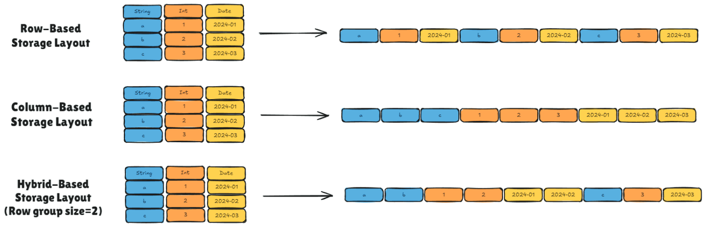

Parquet File Format
===================

At the heart of ParquetDB's architecture is the use of Apache Parquet as the storage format. Parquet is a highly efficient columnar storage format specifically designed to address the complexities of fast query performance and efficient deserialization, particularly for large-scale, complex datasets. This layer directly addresses common data-handling challenges like serialization overhead, allowing ParquetDB to store and query complex datasets in a highly efficient manner. The benefits of Parquet files are:

- **Columnar Format:** Parquet organizes data by columns instead of rows, making it ideal for analytical queries that require only subsets of columns. This format allows for better compression and reduces I/O overhead.
- **Schema Embedding:** Each Parquet file contains a schema that describes the data, ensuring consistency and facilitating schema evolution.
- **Predicate Pushdown:** Parquet's structure allows ParquetDB to optimize queries by reading only relevant data blocks.
- **Predicate Pushdown:** Parquet's structure also enables reading only the relevant columns into memory.
- **Efficient Encoding and Compression:** Parquet files allow for column-level encoding and compression techniques, improving both read performance and storage efficiency.
- **Metadata Support:** Parquet files can store table- and column-level metadata.
- **Batching Support:** Parquet files handle data in batches (groups of column data) which makes them conducive to batching operations.

By using Parquet files, ParquetDB optimizes the serialization and deserialization process, providing fast and scalable data access that fits seamlessly into machine learning and big data pipelines.

.. figure:: ../media/images/parquet_file_format.png
   :width: 80%
   :align: center

   **Parquet File Format Overview.** This diagram illustrates the structure of a Parquet file, including Row Groups, Columns, Pages, and the Footer. The metadata associated with each level provides essential details, such as schema, offsets, compression sizes, encryption, and statistical summaries. These metadata components enable efficient data storage, retrieval, and filtering, making Parquet an ideal choice for analytics and big data processing.

The structure of a Parquet file is depicted in *Figure 3*, where files are partitioned into row groups, which are further divided into column chunks. Each column chunk is composed of pages, representing the smallest unit of storage. A footer at the end of each file consolidates critical metadata, including schema information and statistics for each row group, such as minimum and maximum values. This hierarchical organization supports advanced features such as predicate pushdown and columnar projection, while facilitating efficient data compression and retrieval.

Traditional data storage formats often involve a compromise between row-based storage (optimized for transactional workloads) and column-based storage (ideal for analytical queries). Parquet introduces a hybrid storage model that leverages the benefits of both paradigms, enabling data to be stored in a columnar format while maintaining efficiency for diverse query types. To fully appreciate the advantages of Parquet's hybrid approach, it is crucial to understand the distinction between traditional row-based and column-based formats (see *Figure 4* for an illustration of data organization and access differences). Row-based formats (e.g., CSV or relational databases) store data sequentially by row, making them ideal for workloads requiring frequent row-level operations. However, they are inefficient for analytical queries, which often require scanning entire rows even when only specific columns are needed. In contrast, column-based formats, commonly used in data warehouses, store values from the same column together, enabling faster aggregations and more efficient analytics. Parquet's predominantly columnar approach effectively bridges the gap between transactional and analytical workloads.

Parquet files utilize metadata extensively to optimize data access. This metadata includes schema information, statistics, and offsets, which enable query engines to make informed decisions about data retrieval. For instance, detailed statistics such as minimum and maximum values for each column facilitate predicate pushdown, allowing query engines to bypass irrelevant row groups or pages based on filter conditions. Schema metadata ensures data type consistency, mitigating serialization errors and enhancing interoperability across different platforms. This rich metadata makes Parquet files self-descriptive, significantly improving both usability and performance.

Through detailed metadata, Parquet optimizes data retrieval using several key mechanisms:
 
- **Predicate Pushdown:** Allows the query engine to filter data directly at the storage level, similar to applying a WHERE clause in SQL.
- **Projection Pushdown:** Ensures that only the required columns are retrieved, akin to using the SELECT statement in SQL.

By minimizing the volume of data processed and loaded into memory, these features significantly enhance query performance and reduce computational overhead, making Parquet an ideal choice for big data applications.

Building upon metadata optimization, Parquet achieves high efficiency by minimizing data size through encoding and compression techniques. Encoding reduces data size while preserving direct access to each data point, and compression further reduces the data footprint, saving storage space and optimizing performance for data transfer operations. Parquet supports various encoding techniques (e.g., Plain, Dictionary, Run-Length, Delta) and compression codecs (e.g., GZIP, LZO, BROTLI, ZSTD, LZ4_RAW) that work together to reduce data size and improve performance.

Apache Parquet's robust architecture, rich metadata, and sophisticated encoding/compression strategies make it an ideal foundation for a database. In the next section, we will explore the design and architecture of ParquetDB, demonstrating how these strengths are leveraged to create an efficient, portable database solution. For additional details on the Parquet File format, please refer to the Supplemental Information (SI).

   **Comparison of Storage Layouts.** Row-Based, Column-Based, and Hybrid-Based (Row Group Size = 2). Parquet files utilize a hybrid storage layout, balancing the strengths of row-based and column-based storage by grouping rows together for efficient read and write operations, making them suitable for analytic queries on large datasets.

Parquet File Layout
===================

The Parquet file structure is engineered for optimal performance. Parquet files are partitioned into row groups (horizontal partitions of the dataset), with each row group further divided into column chunks. Each column chunk comprises pages—the smallest storage unit in Parquet. At the end of each file, a footer is appended that contains essential metadata such as the schema, field-level information, and row group statistics (e.g., minimum and maximum values). This hierarchical organization facilitates efficient compression, retrieval, and supports advanced features like predicate pushdown and columnar projection. Metadata is stored at various levels:

- **File-Level Metadata:** Describes the overall structure of the file.
- **Row Group Metadata:** Contains statistics critical for query optimization.

Pages
-----

Pages in Parquet files store the actual data. Each page is composed of two main components:

- **Page Header:** Contains metadata such as data type, uncompressed/compressed page sizes, codec, and encoding details. If dictionary encoding is used, it may also include dictionary page header information.
- **Data Page:** Contains the actual encoded data. If dictionary encoding is used, a separate dictionary page holds the unique values.

Bloom Filter
------------

A Bloom filter is located before the column index and offset index. It provides a probabilistic data structure for quickly testing whether an element is present in a set, aiding in efficient data filtering.

Page Index
----------

The Page Index is located in the footer and provides critical statistics for each data page, enabling efficient data scanning. It consists of:

- **ColumnIndex:** Helps locate data pages containing specific values for a scan predicate.
- **OffsetIndex:** Assists in navigating by row index to retrieve matching values across columns.

These structures allow the reader to access only the necessary data pages, reducing the overhead of reading irrelevant data.

Footer
------

The footer is a critical component that consolidates the file's metadata. It includes:

FileMetaData
^^^^^^^^^^^^

- **Schema:** Describes each column (names, data types, repetition levels, etc.).
- **Version:** The Parquet format version used.
- **Number of Rows:** Total number of rows in the file.
- **Key Value Metadata:** Optional user-defined metadata.
- **Created by:** The software version that created the file.
- **Column Order:** Specifies the ordering of columns.
- **Encryption Algorithm:** If encryption is used.
- **Footer Signing Key Metadata:** Related to encryption.

Schema
^^^^^^

Details each column, including:

- **Column Names**
- **Data Types:** e.g., `INT32`, `FLOAT`, `BYTE_ARRAY`
- **Logical Types:** e.g., `DECIMAL`, `DATE`, `TIMESTAMP`
- **Repetition Levels:** Required, optional, or repeated.
- **Nested Structures:** Details of complex types such as structs, maps, and lists.

Row Group MetaData
^^^^^^^^^^^^^^^^^^

Each row group (a horizontal partition) has metadata that includes:

- **Column Chunks:** Metadata for each column chunk.
- **Total Uncompressed and Compressed Sizes**
- **Number of Rows**
- **Sorting Columns:** If applicable.
- **File Offset and Ordinal:** For locating the row group in the file.

ColumnChunk MetaData
^^^^^^^^^^^^^^^^^^^^

Metadata specific to each column chunk:

- **File Path and Offset**
- **Offset and Column Index Offsets/Lengths**
- **Encryption Metadata**
- **Encrypted Metadata:** If applicable.

Column MetaData
^^^^^^^^^^^^^^^

Details for each column chunk include:

- **Type and Encodings**
- **Path in the Schema**
- **Compression Codec**
- **Number of Values**
- **Uncompressed and Compressed Sizes**
- **Key Value Metadata**
- **Data, Index, and Dictionary Page Offsets**
- **Statistics:** Min, max, null count, etc.
- **Encoding Statistics**
- **Bloom Filter Offset and Length**

How Parquet Files are Written
=============================

Understanding how Parquet files are written is essential to appreciating their efficiency. Although Parquet is a columnar format, data is initially written row by row. Each row is decomposed into individual columns, and the values are accumulated in in-memory column stores. During this phase, metadata such as minimum and maximum values and NULL counts are updated for each column.

When the first 100 rows (or a threshold) are written, the Parquet writer checks if the raw data size exceeds the page size threshold (typically 1 MB). If the size is below the threshold, subsequent pages are adjusted dynamically; otherwise, the data is compressed and flushed to the page store. Each page includes a header with metadata (uncompressed/compressed sizes, value count, statistics, etc.).

After the first 100 rows, the writer checks if the total data size exceeds the row group size (default is 128 MB). If not, the writer adjusts the next check dynamically; if so, the data is flushed to the output stream (e.g., HadoopPositionOutputStream) column by column. Once a row group is flushed, its memory is freed. Note that row groups do not include metadata—this is appended in the footer.

Finally, after all row groups are written, the footer is appended to the file. The footer contains the file schema and row group metadata (total size, number of rows, column statistics, etc.), enabling efficient data retrieval without requiring the entire file to reside in memory.

.. note::
   Storing metadata in the footer allows the Parquet writer to flush row groups immediately after completion, minimizing memory usage.

