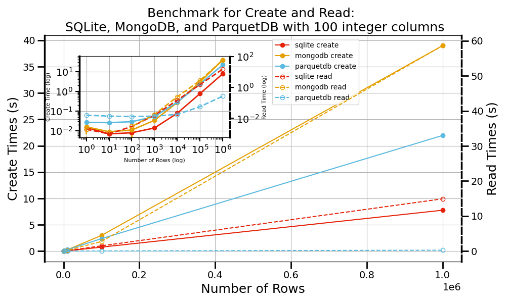

# Summary

ParquetDB is a Python library serving as a "middleware" solution, bridging the gap between file-based storage and full database systems. A key driver for its development was the need to support iterative research workflows, requiring schema evolvability, the ability to manage complex and evolving nested data structures without predefined rigidity, and the ability to handle-table and field-level metadata. Additionally, its "classically serverless" nature was a crucial design point for deployment in environments such as HPC clusters with limited connectivity. Leveraging Apache Parquet [@WelcomeApacheSoftware;@Parquet], it combines file storage portability with advanced querying capabilities, enabling efficient compression and read performance without dedicated server overhead. ParquetDB addresses limitations in both traditional approaches by seamlessly handling complex data types (arrays, nested structures, Python objects), simplifying data interaction compared to direct file manipulation or manual serialization. Performance benchmarks show competitive read/write speeds and effective query performance via predicate pushdown, demonstrating its utility for managing medium-to-large datasets where database complexity is unwarranted but basic file I/O is insufficient.

# Statement of need


The demand for efficient, scalable, and adaptable data storage solutions is critical across research domains. Traditional file formats (e.g., CSV, JSON, TXT) offer simplicity but suffer from inefficiencies, particularly with numerical data due to ASCII/UTF encoding overhead, leading to larger files and slower I/O. While binary formats like HDF5 [@HDF5PythonH5py] improve efficiency for large numerical datasets, they function primarily as structured file containers, lacking the rich querying APIs and transactional integrity features common in databases. These file-based approaches often require manual data relationship management and lack built-in indexing, hindering agility as projects scale or require rapid iteration.

Database systems like SQLite [@allenDefinitiveGuideSQLite2010] or MongoDB [@guoMongoDBsJavaScriptFuzzer2017] provide robust encoding, indexing, and querying. Relational databases ensure integrity via structured schemas but can be rigid when data models evolve [@pascalPracticalIssuesDatabase2000]. NoSQL options offer flexibility but may introduce consistency challenges or require complex optimization [@pivertNoSQLDataModels2018]. Furthermore, many databases involve server configurations or lack transparent file-based portability, adding overhead unsuitable for lightweight experimentation or simpler deployment scenarios. While SQLite is serverless and ubiquitous, its row-based nature can be less performant for analytical queries scanning wide datasets compared to columnar formats, and managing complex nested data can be cumbersome.

Directly using libraries like Apache Arrow (PyArrow) to work with Parquet files offers access to columnar efficiency and querying primitives like predicate pushdown. However, this still requires developers to build abstractions for database-like operations (CRUD), manage schema consistency across multiple files, handle serialization of complex Python objects, and orchestrate data updates or deletions manually. 


While powerful dataframe manipulation libraries like Pandas [@PandasPythonData], Dask [@DaskScalePythona], and Polars [@Polars], or embedded analytical databases such as DuckDB [@InprocessSQLOLAP], are invaluable for many tasks, they may not holistically address the specific needs that motivated ParquetDB. For researchers dealing with evolving, complexly nested scientific data, ParquetDB offers a more streamlined approach to schema evolvability and native Python object persistence directly within a serverless Parquet-based ecosystem. This focus distinguishes it from tools that might require more manual setup for schema management across multiple files, or lack the same emphasis on integrated metadata handling and a 'classically serverless' model for environments like HPC clusters.


ParquetDB addresses this gap, providing a "middleware" layer built upon Python and the Parquet format. It offers a familiar database-like interface (CRUD operations) while leveraging columnar storage for compression and read performance benefits. Crucially, ParquetDB adds value beyond direct Parquet file manipulation by automating schema management (including evolution), simplifying the storage/retrieval of complex Python objects, and providing a unified API to manage collections of Parquet files as a single logical datastore. It supports predicate and column pushdown for optimization within a lightweight, serverless architecture, offering a pragmatic balance for scenarios demanding more than basic files but less than a full database system, particularly where schema flexibility and ease of use are paramount. For a comprehensive feature list, visit our documentation (https://parquetdb.readthedocs.io/en/latest/).

# Benchmarks

We evaluated ParquetDB's performance against SQLite and MongoDB using synthetic datasets (100 integer columns, varying record counts). Our first experiment compared write and read performance. ParquetDB’s creation times are competitive, performing second best behind SQLite as dataset size increases. For bulk read operations, ParquetDB initially lags slightly but significantly outperforms both competitors on larger datasets (beyond several hundred/thousand rows), benefiting from Parquet's columnar efficiency (see Figure 1).

{label="fig:benchmark_create_read_times"}

A "needle-in-a-haystack" benchmark assessed specific record retrieval. While lacking traditional B-tree indexes, ParquetDB uses predicate pushdown leveraging Parquet's field-level statistics for efficient filtering without full scans. It is important to note that performance advantages depend on the workload; for instance, complex analytical queries involving aggregations or returning small, highly filtered results might favor the mature query engine and indexing of systems like SQLite. ParquetDB excels when querying or returning substantial portions of wide datasets. Detailed benchmarks are in our extended paper [@langParquetDBLightweightPython2025].

# Installation

For installation, please use pip:
```python 
pip install parquetdb
```

For more details, please visit the GitHub repository: (https://github.com/lllangWV/ParquetDB). The repository contains additional examples, API documentation, and guidelines for contributing to the project.

# Acknowledgements


We thank the Pittsburgh Supercomputer Center (Bridges2) and San Diego Supercomputer Center (Expanse) through allocation DMR140031 from the Advanced Cyberinfrastructure \mbox{Coordination} Ecosystem: Services \& Support (ACCESS) program, which is supported by \mbox{National} Science Foundation grants \#2138259, \#2138286, \#2138307, \#2137603, and \#2138296. We gratefully acknowledge the computational resources provided by the WVU Research \mbox{Computing} Dolly Sods HPC cluster, partially funded by NSF OAC-2117575. Additionally, we recognize the support from the West Virginia Higher Education Policy Commission through the Research Challenge Grant Program 2022 (Award RCG 23-007), as well as NASA EPSCoR (Award 80NSSC22M0173), for their contributions to this work. The work of E.R.H.  is supported by MCIN/AEI/ 10.13039/501100011033/FEDER, UE through projects PID2022-139776NB-C66. K.C. thanks funding from the CHIPS Metrology Program, part of CHIPS for America, National Institute of Standards and Technology, U.S. Department of Commerce.  Certain commercial equipment, instruments, software, or materials are identified in this paper in order to specify the experimental procedure adequately. Such identifications are not intended to imply \mbox{recommendation} or endorsement by NIST, nor are they intended to imply that the materials or equipment identified are necessarily the best available for the purpose.

# References


