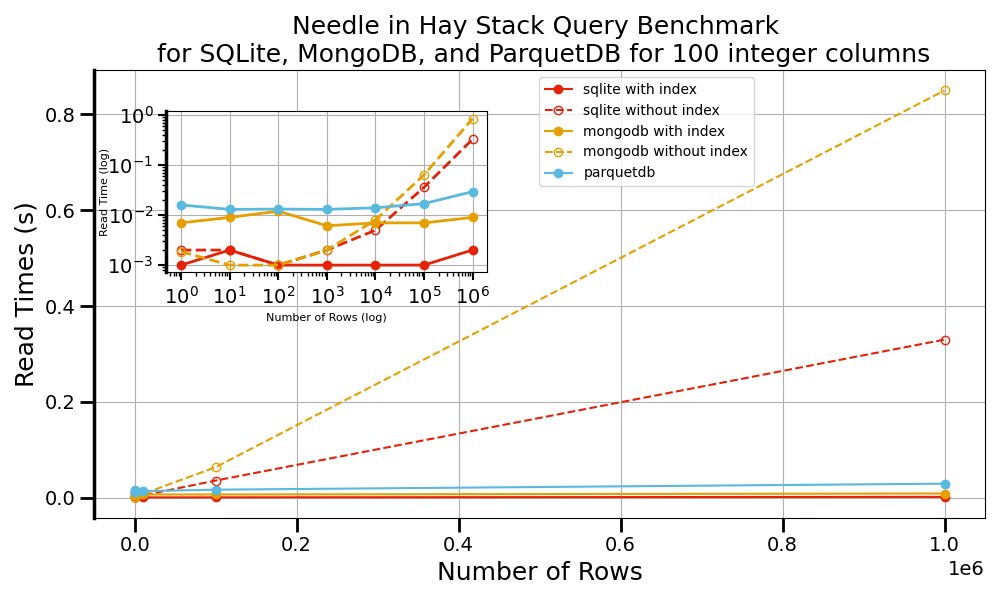

# Summary

ParquetDB is a Python library designed to bridge the gap between traditional file storage and fully fledged databases, all while wrapping the PyArrow library to streamline data input and output. By leveraging the Parquet file format, ParquetDB provides the portability and simplicity of file-based data storage alongside advanced querying features typically found in database systems. Because ParquetDB is built on top of PyArrow, it seamlessly handles data types that need special processing to be compatible with the Parquet format. This reduces manual conversion and boilerplate code, allowing developers to focus on higher-level data operations. In addition, the Parquet format’s columnar storage and rich metadata make it possible to efficiently perform predicate and column pushdown, leading to faster queries by reading only the subsets of data you truly need.

# Statement of need

In an era where data is the driving force behind innovation, the demand for highly efficient, scalable, and adaptable storage solutions has never been greater. Traditional file-based storage formats (e.g., CSV, JSON, TXT) and database systems (e.g., SQLite[@SQLite], MongoDB[@MongoDBDeveloperData]) have historically powered data handling in numerous applications [@habyarimanaGenomicsData2021] [@jainCommentaryMaterialsProject2013] [@WellKnownUsersSQLite] [@CustomerCaseStudies]. However, both approaches exhibit unique limitations that can impede rapid experimentation, large-scale research, and data-intensive development.

File-based solutions are popular for their simplicity and portability, often relying on straightforward ASCII/UTF encoding. This design choice, while human-readable, becomes highly inefficient for numerical data. For example, encoding an integer like 127 in ASCII demands three separate bytes (00110001 00110010 00110111), leading to significant overhead as data volumes expand. Such inflation in file size translates into slower input/output (I/O) operations and increased storage requirements, ultimately restricting scalability. Additionally, file-based formats typically lack built-in querying capabilities and indexing features, forcing developers to manage complex data relationships manually. These constraints limit the agility of workflows, especially as projects grow in complexity or require quick iteration cycles.

Conversely, traditional database management systems offer robust encoding, indexing, and querying capabilities out of the box. Relational databases, for instance, enforce structured schemas that ensure data integrity but introduce complexities when the data model evolves over time. Non-relational databases, such as document-oriented or key-value stores, are more flexible but risk data inconsistency and can become cumbersome to optimize for performance[@singh15TypesDatabases2024]. Many of these solutions require dedicated servers or intricate configurations, increasing overhead for lightweight experimentation. Moreover, the underlying architectures—whether row-based or reliant on specialized storage engines—can exhibit performance bottlenecks when handling unstructured or semi-structured data at scale.

ParquetDB is intended to be a “medium ware” solution that sits between these two paradigms. Built in Python and leveraging the Parquet columnar format, ParquetDB combines the efficiency of column-based data storage with the accessibility of file-based approaches. Columnar storage significantly enhances compression and read performance by grouping similar data together, reducing the cost of both serialization and deserialization. Parquet also preserves rich metadata at the table and column levels, enabling advanced features such as schema enforcement and automated indexing without the overhead typically associated with full-fledged database engines. By integrating these capabilities into a lightweight, serverless architecture, ParquetDB mitigates the complexities of evolving data models, which can pose challenges in rigid relational systems or loosely structured NoSQL stores. Researchers and developers benefit from rapid data access, efficient queries, and a streamlined approach to data serialization. ParquetDB’s compatibility with Python’s scientific ecosystem also facilitates data analysis and machine learning workflows, letting users iterate quickly on large datasets without heavy infrastructure.

Ultimately, ParquetDB delivers a balanced, scalable, and portable platform for data storage and retrieval, addressing the well-known shortcomings of both plain-text file formats and conventional databases. Its columnar design, built-in metadata, and efficient encoding strategies enable fast, cost-effective reads and writes while maintaining a flexible schema structure. By offering this middle ground, ParquetDB helps unify the best of both worlds in data storage, setting a new standard for flexible, high-performance data management that meets the needs of modern analytics and research.


# Features 

| **Features and Benefits** | **Description**                                                                 |
|----------------------------|---------------------------------------------------------------------------------|
| **Simple Interface**       | Easy-to-use methods for creating, reading, updating, deleting, and transforming data.         |
| **High Performance**       | Utilizes Apache Parquet and PyArrow for efficient data storage and retrieval.   |
| **Complex Data Types**     | Handles nested and complex data types (Ex. ndarrays, lists, dictionaries, python functions and classes etc.).|
| **Portability**            | File-based storage, allows for easy transfer. (Any framework that can read a directory of parquet files can read ParquetDB databases)                                   |
| **Schema**                 | Contains a schema that describes the data, ensuring consistency.                |
| **Schema Evolution**       | Supports adding new fields and updating schemas.                                |
| **Predicate Pushdown**     | Optimizes queries by reading only relevant data blocks.                         |
| **Column Pushdown**        | Selects columns to read into memory.                                            |
| **Efficient Encoding**     | Choice of field-level encoding.                                                 |
| **Efficient Compression**  | Choice of field-level compression.                                              |
| **Metadata Support**       | Table and field-level metadata support.                                         |
| **Batching Support**       | Files are grouped to facilitate batching.                                       |

# Benchmarks

In this section, we outline the methodology used to evaluate the performance of ParquetDB in comparison to SQLite and MongoDB. Synthetic datasets consisting of 100 integer columns with varying record counts were used to simulate different load levels. The integer values ranged from 0 to one million, with dataset sizes varying from one row to one million rows. integers were chosen as they are a fundamental data type, allowing us to establish baseline performance metrics with minimal additional computational complexity. Integers were chosen as the benchmark data type since they are primitive and other data types can be extrapolated from their performance. Since integers are more lightweight compared to other data types, such as strings or nested structures, they provide an initial estimation of database performance without the variability introduced by more complex data representations. This approach allows us to evaluate the core efficiency of the database under ideal conditions, providing a best-case scenario. Subsequently, more complex data types may be expected to degrade performance due to increased memory usage and processing demands, and these results provide a reference point for such comparisons




# Installation

For installation, please use pip:
```python 
pip install parquetdb
```

For more details, including advanced features and contributions, please visit the [GitHub repository](https://github.com/lllangWV/ParquetDB). The repository contains additional examples, API documentation, and guidelines for contributing to the project.

# Acknowledgements

We thank the Pittsburgh Supercomputer Center (Bridges2) and San Diego Supercomputer Center (Expanse) through allocation DMR140031 from the Advanced Cyberinfrastructure Coordination Ecosystem: Services \& Support (ACCESS) program, which is supported by National Science Foundation grants \#2138259, \#2138286, \#2138307, \#2137603, and \#2138296. 
We gratefully acknowledge the computational resources provided by the WVU Research Computing Dolly Sods HPC cluster, partially funded by NSF OAC-2117575. Additionally, we recognize the support from the West Virginia Higher Education Policy Commission through the Research Challenge Grant Program 2022 (Award RCG 23-007), as well as NASA EPSCoR (Award 80NSSC22M0173), for their contributions to this work. The work of E.R.H.  is supported by MCIN/AEI/ 10.13039/501100011033/FEDER, UE through projects PID2022-139776NB-C66. K.C. thanks funding from the CHIPS Metrology Program, part of CHIPS for America, National Institute of Standards and Technology, U.S. Department of Commerce.  Certain commercial equipment, instruments, software, or materials are identified in this paper in order to specify the experimental procedure adequately. Such identifications are not intended to imply recommendation or endorsement by NIST, nor are they intended to imply that the materials or equipment identified are necessarily the best available for the purpose.


# References


