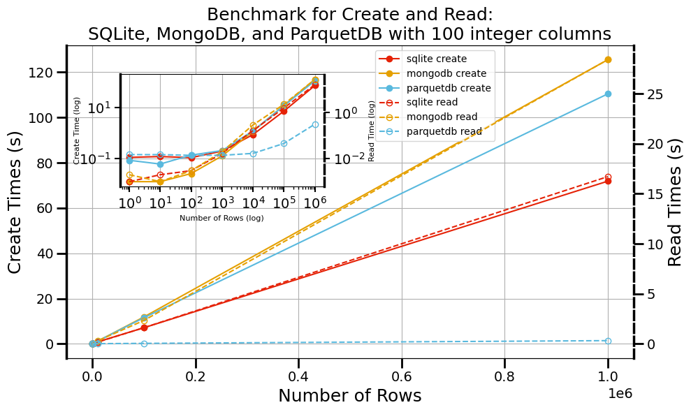

# Summary

ParquetDB is a Python library that serves as a "medium ware" solution, bridging the gap between traditional file-based storage and full database systems while addressing limitations inherent in both approaches. By leveraging the Apache Parquet file format, it combines the portability and simplicity of file storage with advanced querying capabilities typically found in database systems, enabling efficient compression and improved read performance without the overhead of dedicated servers. The library seamlessly handles complex data types including arrays, nested structures, and Python objects, thereby reducing manual conversion and boilerplate code that developers would otherwise need to implement. Performance benchmarks demonstrate that ParquetDB achieves competitive read and write speeds compared to traditional databases, and query performance comparable to indexed database systems through its effective utilization of predicate pushdown filtering and rich metadata.

# Statement of need

In an era where data is the driving force behind innovation, the demand for highly efficient, scalable, and adaptable storage solutions has never been greater. Traditional file-based storage formats (e.g., CSV, JSON, TXT) and database systems (e.g., SQLite [@allenDefinitiveGuideSQLite2010], MongoDB [@guoMongoDBsJavaScriptFuzzer2017]) have historically powered data handling in numerous applications [@habyarimanaGenomicsData2021;@jainCommentaryMaterialsProject2013;@hjorthlarsenAtomicSimulationEnvironment2017]. However, both approaches exhibit unique limitations that can impede rapid experimentation, large-scale research, and data-intensive development.

File-based solutions are popular for their simplicity and portability, often relying on straightforward ASCII/UTF encoding. This design choice, while human-readable, becomes highly inefficient for numerical data. For example, encoding an integer like 127 in ASCII demands three separate bytes (00110001 00110010 00110111), leading to significant overhead as data volumes expand. Such inflation in file size translates into slower input/output (I/O) operations and increased storage requirements, ultimately restricting scalability. Additionally, file-based formats typically lack built-in querying capabilities and indexing features, forcing developers to manage complex data relationships manually. These constraints limit the agility of workflows, especially as projects grow in complexity or require quick iteration cycles.

Conversely, traditional database management systems offer robust encoding, indexing, and querying capabilities out of the box. Relational databases, for instance, enforce structured schemas that ensure data integrity but introduce complexities when the data model evolves over time [@pascalPracticalIssuesDatabase2000]. Non-relational databases, such as document-oriented or key-value stores, are more flexible but risk data inconsistency and can become cumbersome to optimize for performance [@pivertNoSQLDataModels2018]. Many of these solutions require dedicated servers or intricate configurations, increasing overhead for lightweight experimentation. Moreover, the underlying architectures, whether row-based or reliant on specialized storage engines, can exhibit performance bottlenecks when handling unstructured or semi-structured data at scale.

ParquetDB is intended to be a "medium ware" solution that sits between these two paradigms. Built in Python, ParquetDB leverages the Parquet columnar format to store similarly-typed data together in column chunks, combining columnar storage efficiency with file-based accessibility. This approach significantly improves compression and read performance while preserving rich metadata at the table and column levels. ParquetDB offers a simple interface for CRUD operations, supports complex data types (including ndarrays, lists, dictionaries, and Python functions), and provides file-based portability. It features schema management with evolution capabilities, predicate and column pushdown for query optimization, and efficient encoding and compression, all within a lightweight, serverless architecture that mitigates the complexities of evolving data models. For a comprehensive feature list and detailed explanations, please visit our documentation (https://lllangwv.github.io/ParquetDB/index.html).


# Benchmarks

We evaluated ParquetDB's performance against SQLite and MongoDB using synthetic datasets consisting of 100 integer columns with varying record counts to simulate different load levels. In our first experiment, we compared write and read performance across the three databases. For smaller datasets, ParquetDB's create times are comparable to SQLite and MongoDB. As dataset size grows, ParquetDB demonstrates the second-best performance behind SQLite. For read operations, ParquetDB initially lags with small datasets but shows considerable improvement with larger datasets, ultimately outperforming both competitors beyond several hundred to a thousand rows. This improved performance is largely attributed to the efficiency of Parquet's row-columnar storage format.

{label="fig:benchmark_create_read_times"}

We also conducted a "needle-in-a-haystack" benchmark to evaluate query performance for specific record retrieval. While ParquetDB lacks traditional indexing mechanisms, it achieves competitive performance through predicate pushdown filtering that leverages field-level statistics stored in the Parquet schema. This allows for efficient filtering without complete dataset scans. For a detailed analysis of all benchmark experiments, including additional performance metrics and larger datasets, please refer to our extended paper available through arxiv (https://arxiv.org/abs/2502.05311).


# Installation

For installation, please use pip:
```python 
pip install parquetdb
```

For more details, please visit the [GitHub repository](https://github.com/lllangWV/ParquetDB). The repository contains additional examples, API documentation, and guidelines for contributing to the project.

# Acknowledgements

We thank the Pittsburgh Supercomputer Center (Bridges2) and San Diego Supercomputer Center (Expanse) through allocation DMR140031 from the Advanced Cyberinfrastructure Coordination Ecosystem: Services \& Support (ACCESS) program, which is supported by National Science Foundation grants \#2138259, \#2138286, \#2138307, \#2137603, and \#2138296. 
We gratefully acknowledge the computational resources provided by the WVU Research Computing Dolly Sods HPC cluster, partially funded by NSF OAC-2117575. Additionally, we recognize the support from the West Virginia Higher Education Policy Commission through the Research Challenge Grant Program 2022 (Award RCG 23-007), as well as NASA EPSCoR (Award 80NSSC22M0173), for their contributions to this work. The work of E.R.H.  is supported by MCIN/AEI/ 10.13039/501100011033/FEDER, UE through projects PID2022-139776NB-C66. K.C. thanks funding from the CHIPS Metrology Program, part of CHIPS for America, National Institute of Standards and Technology, U.S. Department of Commerce.  Certain commercial equipment, instruments, software, or materials are identified in this paper in order to specify the experimental procedure adequately. Such identifications are not intended to imply recommendation or endorsement by NIST, nor are they intended to imply that the materials or equipment identified are necessarily the best available for the purpose.

# References


